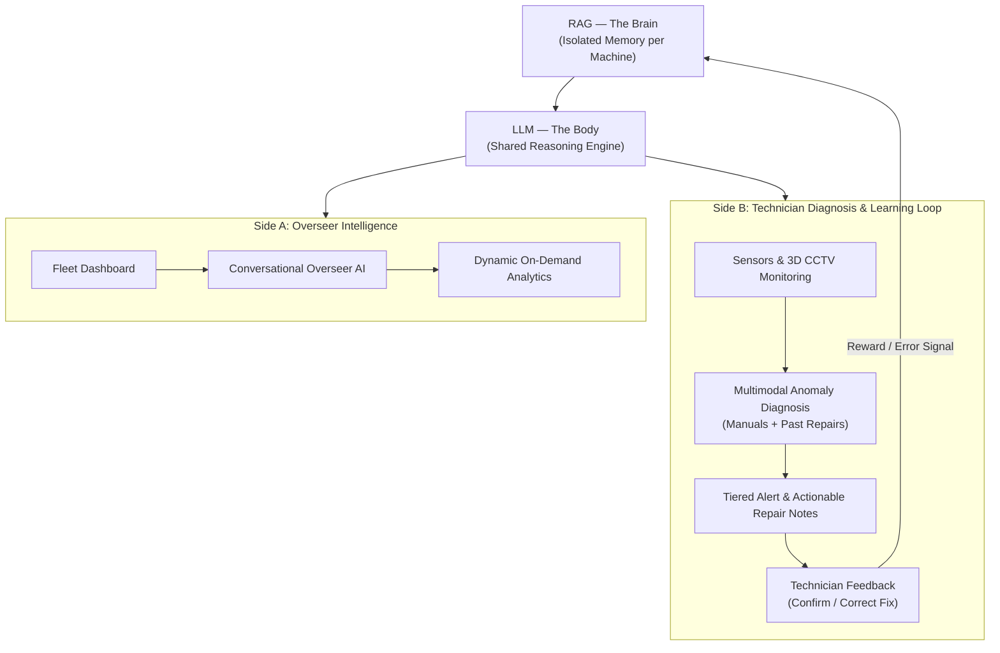

# ⚙️ Fixer.ai
### The Continuously Learning RAG Technician for Industrial Machines
*HackfiniX 2026 Finals | CITNC Bengaluru | Smart Manufacturing & Human–AI Collaboration*

---

## 💡 The Core Idea

In modern manufacturing (automotive, aerospace, precision robotics), unplanned downtime costs **₹18,00,000 every single minute** (over **₹1.08 Crore per hour**).

Existing ML models predict failure curves generically, but they have no memory of an individual machine's actual quirks, operating history, or past repairs. There is no equivalent of an experienced master technician who has "lived with" a machine for years.

**Fixer.ai** solves this by acting as a **permanent digital technician** for every asset in a fleet:
- 🧠 **RAG as the Brain (Per-Machine Memory)**: Each machine has an isolated knowledge base that learns its specific wear patterns, sensor tolerances, and past repairs.
- ⚡ **LLM as the Body (Shared Reasoning)**: A single high-performance reasoning engine that pulls context dynamically from the relevant machine's brain without expensive per-machine retraining.
- 🔄 **Continuous Learning via Feedback**: When a technician confirms a fix, it triggers an RLHF-style reward signal. When corrected, it logs the error and updates the machine's memory.
- 🎥 **Real-Time 3D Digital Twin CCTV**: Replaces overwhelming 50-row spreadsheets with spatial human intuition — the 3D model physically shudders and pulses red at the failing joint.
- 📦 **Enterprise Delivery**: Packaged as an on-premises Docker container deployed with Field Deployment Engineer (FDE) support for regulated, air-gapped factories.

---

## 🔄 Dual-Engine Architecture



---

## 🚀 Quick Start Guide

### 1. For Backend Developers (Python 3.10+)
```bash
# Clone the repository
git clone <repo-url>
cd fixer.ai

# Install Python requirements
pip install -r requirements.txt

# Bootstrap database and vector store
python scripts/bootstrap.py

# Launch FastAPI backend server (Runs at http://localhost:8000)
python -m uvicorn backend.main:app --host 0.0.0.0 --port 8000 --reload
```

### 2. For Frontend Developers (Node.js 18+)
```bash
# Navigate to frontend folder
cd frontend

# Install dependencies
npm install

# Start Vite dev server (Runs at http://localhost:5173)
npm run dev
```

---
